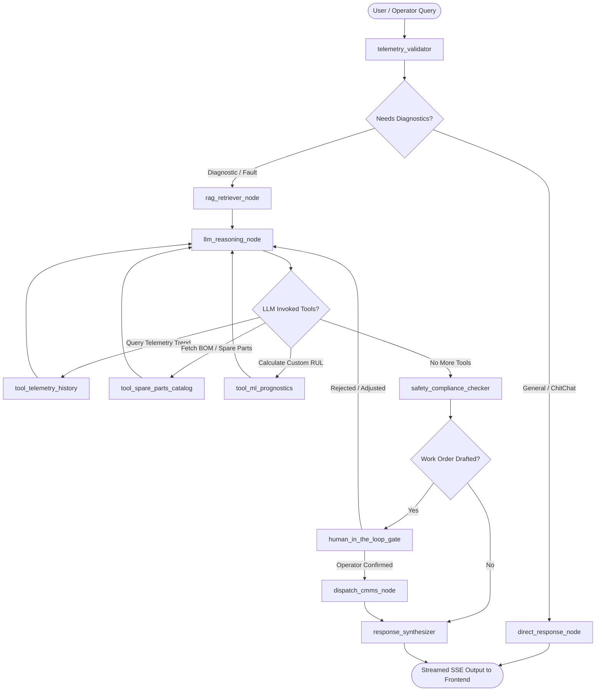

# Agentic AI Architecture Blueprint: LLM & LangGraph Integration

> **Project:** AI-Powered Industry 4.0 Predictive Maintenance Platform (AIoT)  
> **Subsystem:** AI Backend (`ai_backend`)  
> **Version:** 2.0 Architectural Specification  
> **Target Frameworks:** `LangGraph` (StateGraph) + `LangChain` + Multi-Provider LLM (OpenAI / Anthropic / Gemini / Ollama)

---

## 1. Executive Summary

The existing predictive maintenance platform currently utilizes:
- Deterministic heuristic mapping for ReAct reasoning steps in [copilot/agent.py](file:///c:/Coding/PMP_AIoT/ai_backend/copilot/agent.py).
- Keyword-based vector search simulation in [rag/knowledge_store.py](file:///c:/Coding/PMP_AIoT/ai_backend/rag/knowledge_store.py).
- Statistical / ISO 10816 anomaly scoring in [models/ml_prognostics.py](file:///c:/Coding/PMP_AIoT/ai_backend/models/ml_prognostics.py).

This document outlines the end-to-end blueprint to upgrade the AI service into an **autonomous, agentic LLM workflow orchestrated by LangGraph**.

### Key Objectives
1. **Dynamic Reasoning & Tool Calling:** Replace static regex/string matching with genuine LLM reasoning, allowing operators to ask complex, unstructured questions.
2. **Cyclical StateGraph Workflow:** Use **LangGraph** to model multi-step diagnostics, iterative data retrieval, and validation loops with state persistence.
3. **Grounded RAG (Retrieval-Augmented Generation):** Retrieve authentic chunks from OEM technical manuals (load cell calibration, bearing specs, belt tensioning) with vector embeddings.
4. **Human-in-the-Loop (HITL) Safety Gate:** Mandate human approval before dispatching high-impact work orders or automated emergency lockout procedures.
5. **Air-Gapped / Hybrid Support:** Support cloud frontier models (OpenAI GPT-4o, Claude 3.5, Gemini) alongside local on-prem models (Ollama / vLLM with Llama 3.1 8B) for industrial edge installations.

---

## 2. Architecture Comparison: Current vs. Proposed

```
CURRENT (v1.0):
Operator Query ──▶ Heuristic Regex ──▶ Hardcoded If/Else ──▶ Static String Template ──▶ Response

PROPOSED (v2.0):
Operator Query ──▶ LangGraph StateGraph
                      ├── Node 1: Telemetry Ingestion & Validation
                      ├── Node 2: OEM RAG Semantic Search
                      ├── Node 3: LLM Diagnostic Reasoner (ReAct Tool Loop)
                      ├── Node 4: Safety & Compliance Verifier
                      ├── Node 5: CMMS Work Order Generator (Human Approval Gate)
                      └── Node 6: Response Synthesizer & Citation Grounding
```

---

## 3. LangGraph StateGraph Architecture

### Workflow Diagram (Mermaid)



---

## 4. State Definition (`AgentState`)

LangGraph operates over a centralized, typed state container that accumulates context as the execution graph transitions between nodes.

```python
# ai_backend/copilot/state.py
from typing import Annotated, Sequence, TypedDict, Optional, List, Dict, Any
from langchain_core.messages import BaseMessage
from langgraph.graph.message import add_messages

class DiagnosticReport(TypedDict, total=False):
    root_cause: str
    confidence: float
    affected_components: List[str]
    iso_zone: str
    iso_breached: bool
    recommended_action: str

class WorkOrderDraft(TypedDict, total=False):
    work_order_id: str
    equipment_id: str
    priority: str
    spares_required: List[Dict[str, str]]
    lubricant: str
    torque_specs: str
    safety_procedure: str
    estimated_downtime_hours: float
    status: str  # "DRAFT", "PENDING_APPROVAL", "APPROVED", "DISPATCHED"

class MaintenanceAgentState(TypedDict):
    """
    Centralized LangGraph State for the AIoT Maintenance Copilot.
    """
    # Chat history with automatic message appending
    messages: Annotated[Sequence[BaseMessage], add_messages]
    
    # Real-time Equipment Snapshot
    equipment_id: str
    plant_id: str
    health_score: float
    active_failure_mode: Optional[str]
    sensor_telemetry: Dict[str, Any]
    
    # Retrieved Engineering RAG Citations
    retrieved_documents: List[Dict[str, Any]]
    
    # Step-by-step audit reasoning traces for industrial explainability
    reasoning_traces: List[Dict[str, Any]]
    
    # Structured diagnostic findings
    diagnosis: Optional[DiagnosticReport]
    
    # Generated work order (if applicable)
    work_order: Optional[WorkOrderDraft]
    
    # Safety flags
    safety_violation: bool
    requires_human_approval: bool
```

---

## 5. LangGraph Node Definitions

### Node 1: `telemetry_validator`
- **Role:** Extracts the real-time sensor snapshot sent from the React frontend or MongoDB.
- **Function:** Normalizes vibration, bearing temperature, load cell drift, and motor current against baseline thresholds. If an active anomaly is detected, updates `state["diagnosis"]["iso_breached"]`.

### Node 2: `rag_retriever_node`
- **Role:** Performs semantic vector search against indexed technical documentation.
- **Target Collections:**
  - `OEM_MANUALS`: Load-cell tare calibration, belt tracking, take-up cylinder pressures.
  - `SOP_DOCS`: Lockout/tagout procedures (LOTO), bearing replacement (SKF SRB-22212), greasing specs (Shell Gadus).
  - `HISTORICAL_INCIDENTS`: Post-mortem failure work orders and past repair resolutions.
- **Output:** Appends top-k formatted chunks to `state["retrieved_documents"]`.

### Node 3: `llm_reasoning_node`
- **Role:** Core LLM ReAct agent with custom tools.
- **Model:** Configurable (`gpt-4o`, `claude-3-5-sonnet`, `gemini-1.5-pro`, or local `llama3.1:8b`).
- **Prompt:** System prompt grounded with industrial physics, ISO 10816 standards, and step-by-step diagnostic methodologies.
- **Tools Attached to LLM:**
  - `query_sensor_trends(sensor_name, window_minutes)`: Fetches historical trend lines from MongoDB time-series collection.
  - `calculate_rul(equipment_id, current_telemetry)`: Calls Python `MLPrognosticsEngine`.
  - `lookup_part_number(component_name)`: Queries internal ERP/SAP spare parts catalog.
  - `draft_cmms_work_order(fields)`: Formats standard maintenance work order draft.

### Node 4: `safety_compliance_checker`
- **Role:** Guardrail verification node.
- **Enforcement:**
  - If recommendation involves opening electrical enclosures or disassembling drive components, mandates **Lockout/Tagout (LOTO)** reference `DOC-SAF-004`.
  - If vibration exceeds **Zone D (> 7.1 mm/s)**, forces priority to **CRITICAL/IMMEDIATE SHUTDOWN**.

### Node 5: `human_in_the_loop_gate`
- **Role:** Intercepts work order creation before execution.
- **LangGraph Implementation:** Uses LangGraph's `interrupt()` primitive to pause execution and request human operator sign-off in the UI.

### Node 6: `response_synthesizer`
- **Role:** Generates clean Markdown response for the frontend drawer, including clickable OEM citations and visual reasoning step accordion.

---

## 6. Concrete Implementation Code Blueprint

### 6.1 Requirements Update (`ai_backend/requirements.txt`)
```text
fastapi>=0.110.0
uvicorn[standard]>=0.28.0
pydantic>=2.6.0
numpy>=1.26.0

# LangChain & LangGraph Ecosystem
langgraph>=0.2.0
langchain>=0.3.0
langchain-core>=0.3.0
langchain-openai>=0.2.0
langchain-anthropic>=0.2.0
langchain-google-genai>=2.0.0
langchain-community>=0.3.0

# Vector Embeddings & RAG
chromadb>=0.5.0
sentence-transformers>=3.0.0
```

### 6.2 Agent Graph Builder (`ai_backend/copilot/graph.py`)

```python
from langgraph.graph import StateGraph, END
from langgraph.checkpoint.memory import MemorySaver
from langchain_core.messages import SystemMessage, HumanMessage

from copilot.state import MaintenanceAgentState
from copilot.nodes.telemetry import telemetry_validator_node
from copilot.nodes.rag import rag_retriever_node
from copilot.nodes.reasoner import llm_reasoning_node, should_call_tools
from copilot.nodes.safety import safety_compliance_node
from copilot.nodes.work_order import work_order_drafting_node
from copilot.nodes.synthesizer import response_synthesizer_node
from copilot.tools import tool_node

def build_maintenance_graph():
    """
    Compiles the cyclical LangGraph StateGraph for predictive maintenance.
    """
    workflow = StateGraph(MaintenanceAgentState)

    # 1. Register Nodes
    workflow.add_node("telemetry_validator", telemetry_validator_node)
    workflow.add_node("rag_retriever", rag_retriever_node)
    workflow.add_node("llm_reasoner", llm_reasoning_node)
    workflow.add_node("tools", tool_node)
    workflow.add_node("safety_compliance", safety_compliance_node)
    workflow.add_node("work_order_generator", work_order_drafting_node)
    workflow.add_node("response_synthesizer", response_synthesizer_node)

    # 2. Build Control Flow Edges
    workflow.set_entry_point("telemetry_validator")
    workflow.add_edge("telemetry_validator", "rag_retriever")
    workflow.add_edge("rag_retriever", "llm_reasoner")

    # ReAct Tool Calling Loop
    workflow.add_conditional_edges(
        "llm_reasoner",
        should_call_tools,
        {
            "call_tools": "tools",
            "complete": "safety_compliance"
        }
    )
    workflow.add_edge("tools", "llm_reasoner")

    # Safety & Work Order Branch
    workflow.add_conditional_edges(
        "safety_compliance",
        lambda state: "generate_wo" if state.get("requires_human_approval") else "synthesize",
        {
            "generate_wo": "work_order_generator",
            "synthesize": "response_synthesizer"
        }
    )
    workflow.add_edge("work_order_generator", "response_synthesizer")
    workflow.add_edge("response_synthesizer", END)

    # In-memory checkpointer for conversational thread tracking
    memory = MemorySaver()
    app = workflow.compile(checkpointer=memory)
    return app
```

### 6.3 Tool Definitions (`ai_backend/copilot/tools.py`)

```python
from langchain_core.tools import tool
from models.ml_prognostics import MLPrognosticsEngine
from models.schemas import TelemetryInput

@tool
def calculate_ml_prognostics(health_score: float, vibration_drive: float, motor_temp: float) -> str:
    """
    Computes real-time Remaining Useful Life (RUL), Failure Probability,
    and ISO 10816 degradation severity for industrial feeders.
    """
    tel = TelemetryInput(
        healthScore=health_score,
        sensors={
            "vibration_drive": {"value": vibration_drive, "unit": "mm/s"},
            "motor_temp": {"value": motor_temp, "unit": "°C"}
        }
    )
    pred = MLPrognosticsEngine.predict(tel)
    return (
        f"Predicted RUL: {pred.estimatedRulHours} operating hours | "
        f"Failure Probability: {pred.failureProbability}% | "
        f"Degradation Stage: {pred.degradationStage} | "
        f"Trend: {pred.healthScoreTrend}"
    )

@tool
def lookup_spare_parts_catalog(component_code: str) -> str:
    """
    Returns OEM part number, bin storage location, and inventory level for industrial components.
    """
    parts_db = {
        "SKF_22212": "Part #SKF 22212 E/C3 Spherical Roller Bearing (Bin: M-14-A, Qty: 4)",
        "VRING_SEAL": "Part #Triple-lip contact seal 60x85x10 (Bin: S-02-C, Qty: 12)",
        "SHELL_GADUS": "Shell Gadus S2 V220 2 Lubricant (Bin: LUB-01, Qty: 20kg)"
    }
    return parts_db.get(component_code, "Component not found in warehouse catalogue.")
```

---

## 7. Multi-Provider LLM Configuration Strategy

To guarantee zero downtime and cloud-agnostic operation, the agent dynamically picks an LLM based on environment variables:

| Provider | Environment Variable | Recommended Model | Use Case |
|---|---|---|---|
| **OpenAI** | `OPENAI_API_KEY` | `gpt-4o` | Production Cloud (Fast reasoning + structured JSON) |
| **Anthropic** | `ANTHROPIC_API_KEY` | `claude-3-5-sonnet-20241022` | Long-context OEM manual parsing & RCA |
| **Google Gemini** | `GEMINI_API_KEY` | `gemini-1.5-pro` | Low latency & deep multimodal telemetry analysis |
| **Local / Ollama** | `OLLAMA_BASE_URL` | `llama3.1:8b` / `qwen2.5:14b` | **Air-gapped on-prem industrial plant network** |

### Fallback Mechanism:
If no API keys are present (or if all external LLMs time out), the agent automatically falls back to the local rule-based heuristic engine in [copilot/agent.py](file:///c:/Coding/PMP_AIoT/ai_backend/copilot/agent.py) so the dashboard **never crashes**.

---

## 8. Frontend Integration (Streaming & Human Approval)

In [pmp_FE/src/components/AICopilotDrawer.tsx](file:///c:/Coding/PMP_AIoT/pmp_FE/src/components/AICopilotDrawer.tsx):
1. **Server-Sent Events (SSE) Streaming:** FastAPI exposes `/api/copilot/stream` returning streaming tokens as LangGraph generates reasoning traces.
2. **Interactive HITL Actions:** When LangGraph reaches `human_approval_checkpoint`, the frontend renders interactive buttons:
   - `[✅ Approve & Dispatch to SAP/Maximo]`
   - `[✏️ Adjust Spares / Shift Window]`
   - `[❌ Dismiss Recommendation]`

---

## 9. Phased Implementation Roadmap

| Phase | Milestone | Estimated Effort |
|---|---|---|
| **Phase 1** | Install `langgraph` + `langchain` in `ai_backend` & configure dynamic model loader. | 1 Day |
| **Phase 2** | Implement `AgentState` schema and wrap RAG + ML Prognostics into LangChain Tools. | 2 Days |
| **Phase 3** | Build LangGraph cyclical ReAct graph (`telemetry_validator` ➔ `rag` ➔ `reasoner` ➔ `safety`). | 2 Days |
| **Phase 4** | Add Human-in-the-Loop checkpointer for CMMS work order generation. | 1 Day |
| **Phase 5** | Add FastAPI streaming endpoint (`/api/copilot/stream`) and integrate with Vite frontend drawer. | 1 Day |
